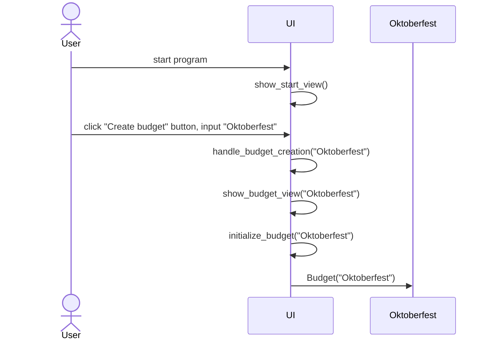
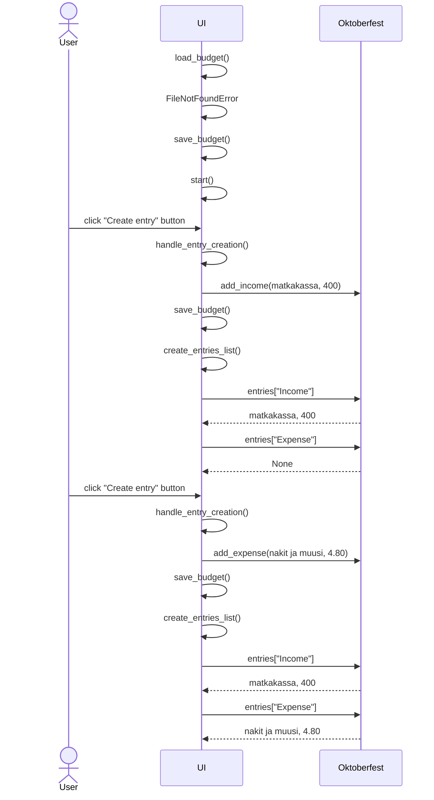

# Arkkitehtuurikuvaus

Sovelluksen tähänastisen toteutuksen arkkitehtuurikuvaus.

## Rakenne

Ohjelman rakenne on seuraavanlainen. Pakkaus *src* sisältää ohjelman käynnistyksestä vastaavan luokan *main*, sekä sovelluksen käyttämän budjetti-tietokohteen luokan *Budget*. Pakkaus *ui* sisältää ohjelman käyttöliittymästä vastaavat luokat *GUI*, *StartView* ja *BudgetView*. *BudgetView* tallentaa budjetin sisältösanakirjan budjetin nimen mukaiseen .pkl-tiedostoon.

Pakkauskaavio:

Luokkakaavio:

## Käyttöliittymä

Ohjelman käyttöliittymä sisältää kaksi näkymää:
1. Aloitusnäkymä
2. Budjettinäkymä

Nämä ovat eriytetty omiin luokkiinsa, ja niiden näyttämisestä vastaa luokka *GUI*. Käyttäjä voi luoda aloitusnäkymässä budjetin. Tällöin siirrytään budjettinäkymään, eli budjetin sisäiseen näkymään, jossa käyttäjä voi lisätä budjettiin tuloja tai menoja.

## Toiminnallisuudet

Esitetään sovelluksen käytöstä esimerkkitilanne sekvenssikaavioilla. 

> [!NOTE]
> Tämän dokumentin sekvenssikaavioissa sovelluksen käyttöliittymään eli luokkiin `GUI`, `StartView`, `BudgetView` viitataan yhteisesti termillä `UI` kaavion yksinkertaistamiseksi.

### Budjetin luominen

1. Sovellus käynnistyy suorittamalla tiedosto `main.py`.
2. Luokka `main` käynnistää Tkinter-ikkunan ja alustaa graafisen käyttöliittymän luokan `GUI`.
3. `GUI` alustaa luokan `StartView`.
4. Sovellus avautuu aloitusnäkymään, jossa käyttäjä voi luoda budjetin. Esimerkkinä, käyttäjä luo budjetin nimisyötteellä "Oktoberfest".
5. `StartView` käsittelee syötteen ja välittää sen `GUI`:lle.
6. `GUI` alustaa nimisyötteellä luokan `BudgetView`, joka alustaa `Budget`-luokan olion `Oktoberfest`. `BudgetView` on siis riippuvainen luokasta `Budget`
8. Sovellus siirtyy budjettinäkymään, tässä tapauksessa budjetin `Oktoberfest` sisäiseen näkymään.

Sekvenssikaavio:

### Kirjausten lisääminen budjettiin

0. Kun siirrytään budjettinäkymään, `BudgetView` tarkistaa, onko kyseisellä nimellä olemassa tallennustiedostoa. Tässä esimerkissä ei ole, joten luodaan uusi tiedosto `Oktoberfest_data.pkl`.
1. Kun budjetti on luotu, käyttäjä voi lisätä siihen kirjauksia. Esimerkkitapauksessa olkoon käyttäjä reissunsa alussa, ja lisää budjettiin `Oktoberfest` tulomerkinnän `matkakassa`.
2. `BudgetView` lisää tulon `Oktoberfest`:n sanakirjaan ja tallentaa muutokset budjetin datan tiedostoon.
3. `BudgetView` hakee sanakirjan sisällön ja esittää sen käyttöliittymässä. Sisältö tulee näkyviin omassa kehyksessään `entries_frame`, kun budjettiin luodaan ensimmäinen kirjaus.
4. Käyttäjä lisää menokirjauksen `nakit ja muusi`. `BudgetView` lisää menon sanakirjaan.
5. `BudgetView` hakee sanakirjan sisällön ja päivittää sisältönäkymän poistamalla vanhan kehyksen ja luomalla uuden. Sovellus luo/päivittää budjetin sisällön kehyksen, kun uusi kirjaus luodaan.

Sekvenssikaavio:

## Ohjelman rakenteeseen jääneet heikkoudet, kehitysideat

Kuten testausdokumentissakin mainittiin, ohjelman käyttöliittymän luokka BudgetView hoitaa tällä hetkellä budjetin sisällön tallentamisen tiedostoihin, ja sisällön lataamisen tiedostoista. Kaikkein suotavinta tällaisten tilanteiden välttämiseksi olisi, että ohjelman toiminnallisuus erotettaisiin täysin käyttöliittymästä. 

Tämän seikan voisi huomioida toteuttamalla ulkopuolisen BudgetService-luokan. Luokan Budget voisi lisäksi erottaa omaksi olio-luokakseen, jolloin sovelluksen toiminnallisuus jätettäisiin kokonaan BudgetService-luokan vastuulle.

