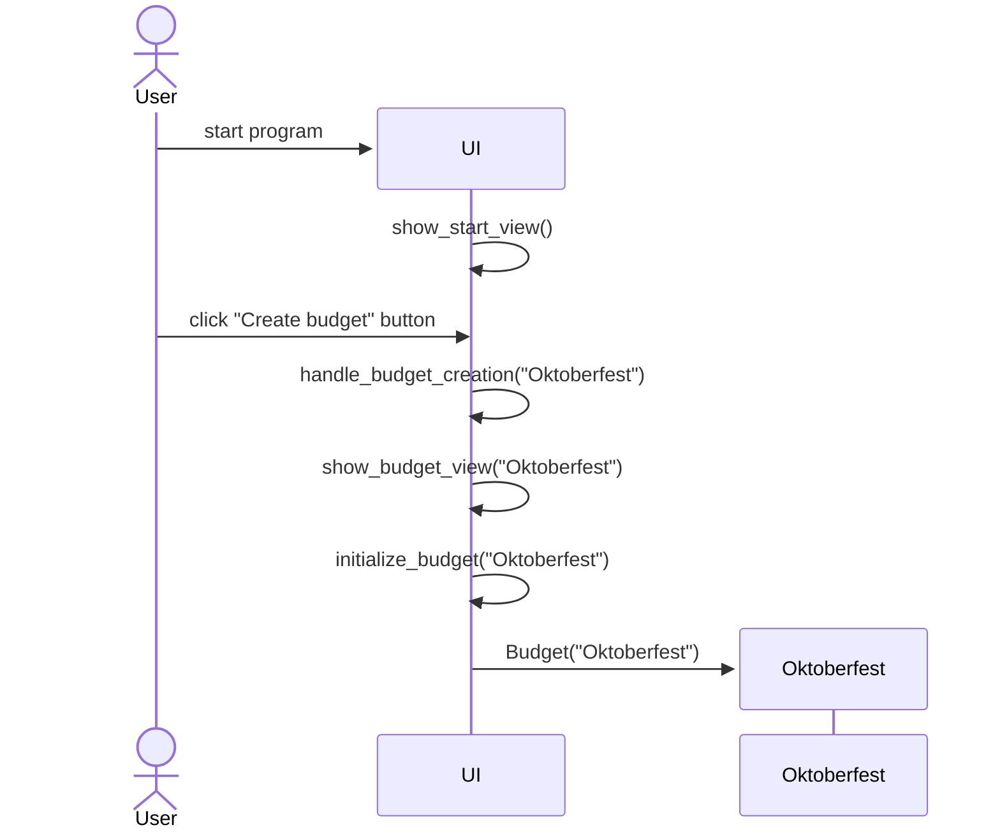
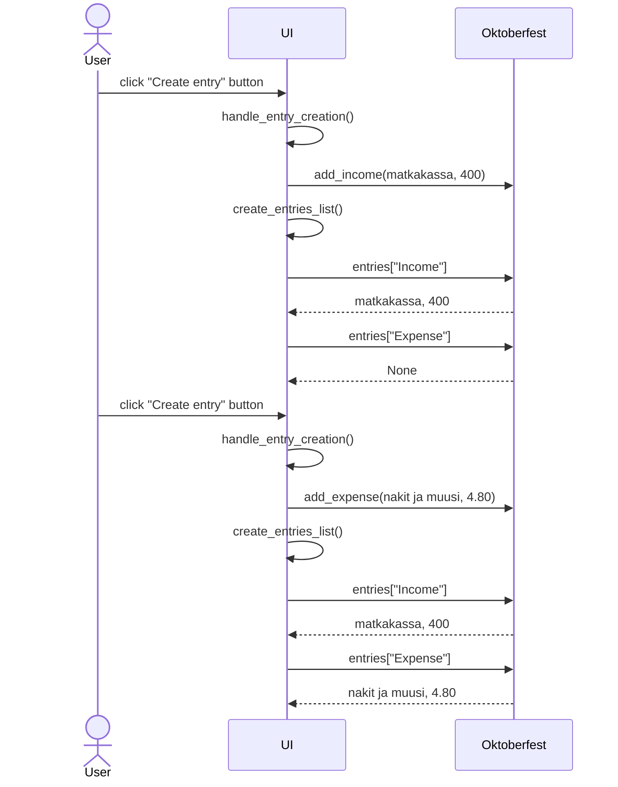

# Arkkitehtuuri 

Sovelluksen tämänhetkisen toiminnallisuuden arkkitehtuurikuvaus.

## Budjetin luominen

1. Sovellus käynnistyy suorittamalla tiedosto `main.py`, jonka luokka `main` käynnistää Tkinter-ikkunan ja alustaa graafisen käyttöliittymän `GUI`-emoluokan.
2. `GUI` alustaa alaluokan `StartView`. Sovellus avautuu aloitusnäkymään, jossa käyttäjä voi luoda budjetin. Esimerkkinä, käyttäjä luo budjetin nimisyötteellä "Oktoberfest".
3. `StartView` käsittelee syötteen ja palauttaa sen `GUI`:lle.
4. `GUI` alustaa alaluokan `BudgetView` nimisyötteen kera. `BudgetView` alustaa `Budget`-luokan olion `Oktoberfest`. 
5. Sovellus siirtyy budjetin `Oktoberfest` sisäiseen näkymään.

> [!NOTE]
> Esitetyissä sekvenssikaavioissa luokkiin `GUI`, `StartView`, `BudgetView` viitataan yhteisesti termillä `UI`, joka esittää käyttöliittymää kokonaisuudessaan.
> Alla esitetty pakkauskaavio havainnollistaa tätä rakennetta.

Pakkauskaavio:

Sekvenssikaavio:

## Kirjausten lisääminen budjettiin
Kun budjetti on luotu, käyttäjä voi lisätä siihen kirjauksia. Esimerkissä käyttäjä syöttää Tammikuun budjetin tulokirjauksen `matkakassa, 800`, ja tämän jälkeen menokirjauksen `nakit ja muusi, 4.80`. 
Budjetin sisältö tulee näkyviin omassa kehyksessään `entries_frame`, kun budjettiin luodaan ensimmäinen kirjaus. Sovellus luo/päivittää budjetin sisällön kehyksen, kun uusi kirjaus luodaan.

Sekvenssikaavio:

