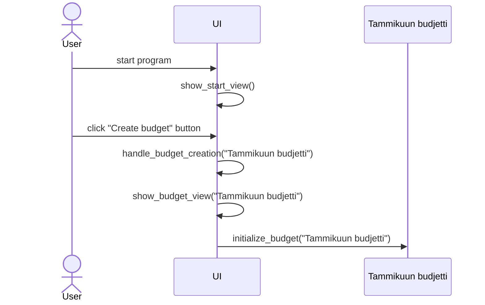
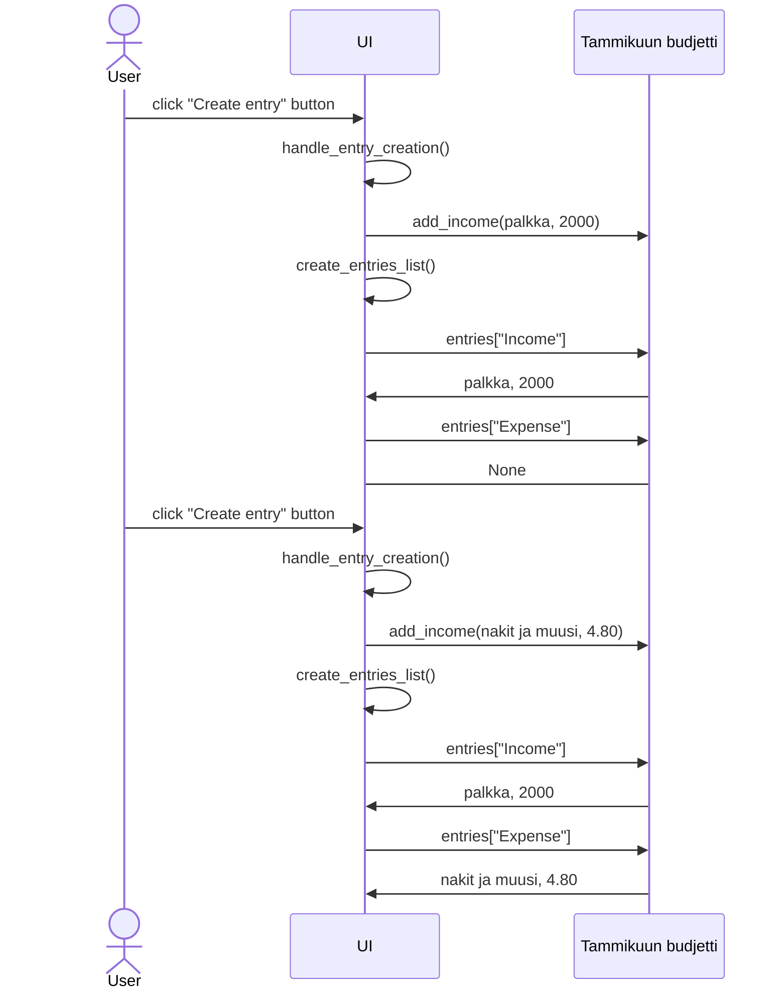

# Arkkitehtuuri 

Sovelluksen tämänhetkinen arkkitehtuuri.

## Budjetin luominen

1. Sovellus käynnistyy suorittamalla tiedosto main.py. Tämä alustaa graafisen käyttöliittymän emoluokan GUI, joka vuorostaan alustaa luokan StartView.
2. Sovellus aukeaa aloitusnäkymään, jossa käyttäjä voi luoda budjetin. Tässä esimerkissä käyttäjä luo budjetin "Tammikuun budjetti". Tällöin alustetaan luokka BudgetView, jonka yhteydessä alustetaan luokka Budget. 
3. Sovellus siirtyy budjetin sisäiseen näkymään. Budget-luokka alustaa sanakirjan, joka sisältää tyhjät listat "Income" ja "Expense". 

## Kirjausten lisääminen budjettiin
Kun budjetti on luotu, käyttäjä voi lisätä siihen kirjauksia. Esimerkissä käyttäjä syöttää Tammikuun budjetin tulokirjauksen `palkka, 2000`, ja tämän jälkeen menokirjauksen `nakit ja muusi, 4.80`. 
Budjetin sisältö tulee näkyviin omassa kehyksessään `entries_frame`, kun budjettiin luodaan ensimmäinen kirjaus. Sovellus luo/päivittää budjetin sisällön kehyksen, kun uusi kirjaus luodaan.

