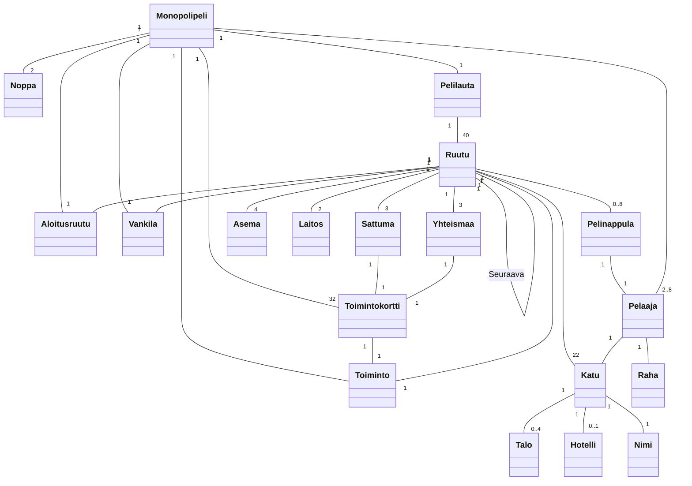

```mermaid
 classDiagram
    Monopolipeli "1" -- "2" Noppa
    Monopolipeli "1" -- "1" Pelilauta
    Monopolipeli "1" -- "1" Aloitusruutu
    Monopolipeli "1" -- "1" Vankila
    Monopolipeli "1" -- Toiminto
    Monopolipeli "1" -- "32" Toimintokortti
    Toimintokortti "1" -- "1" Toiminto
    Pelilauta "1" -- "40" Ruutu
    Ruutu "1" -- "3" Sattuma
    Sattuma "1" -- "1" Toimintokortti 
    Yhteismaa "1" -- "1" Toimintokortti
    Ruutu "1" -- "1" Ruutu : Seuraava
    Ruutu "1" -- Vankila
    Ruutu "1" -- Aloitusruutu
    Ruutu "1" -- "3" Yhteismaa
    Ruutu "1" -- "4" Asema
    Ruutu "1" -- "2" Laitos
    Ruutu "1" -- "22" Katu
    Katu "1" -- "0..4" Talo
    Katu "1" -- "0..1" Hotelli
    Katu "1" -- "1" Nimi
    Ruutu "1" -- "1" Toiminto

    Ruutu "1" -- "0..8" Pelinappula
    Pelinappula "1" -- "1" Pelaaja
    Pelaaja "2..8" -- "1" Monopolipeli
    Pelaaja "1" --  Katu
    Pelaaja "1" -- Raha
```

