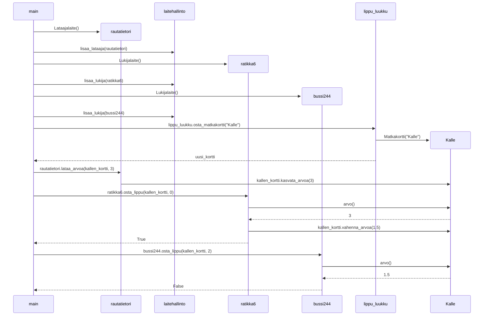

```mermaid
sequenceDiagram
    participant main
    create participant rautatietori
    main->>rautatietori: Lataajalaite()
    participant laitehallinto
    main->>laitehallinto: lisaa_lataaja(rautatietori)
    create participant ratikka6
    main->>ratikka6: Lukijalaite()
    main->>laitehallinto: lisaa_lukija(ratikka6)
    create participant bussi244
    main->>bussi244: Lukijalaite()
    main->>laitehallinto: lisaa_lukija(bussi244)
    participant lippu_luukku
    main->>lippu_luukku: lippu_luukku.osta_matkakortti("Kalle")
    create participant Kalle
    lippu_luukku->>Kalle: Matkakortti("Kalle")
    lippu_luukku-->>main: uusi_kortti
    main->>rautatietori: rautatietori.lataa_arvoa(kallen_kortti, 3)
    rautatietori->>Kalle: kallen_kortti.kasvata_arvoa(3)
    main->>ratikka6: ratikka6.osta_lippu(kallen_kortti, 0)
    ratikka6->>Kalle: arvo()
    Kalle-->>ratikka6: 3
    ratikka6->>Kalle: kallen_kortti.vahenna_arvoa(1.5)
    ratikka6-->>main: True

    main->>bussi244: bussi244.osta_lippu(kallen_kortti, 2)
    bussi244->>Kalle: arvo()
    Kalle-->>bussi244: 1.5
    bussi244-->>main: False
    

    
    

```
